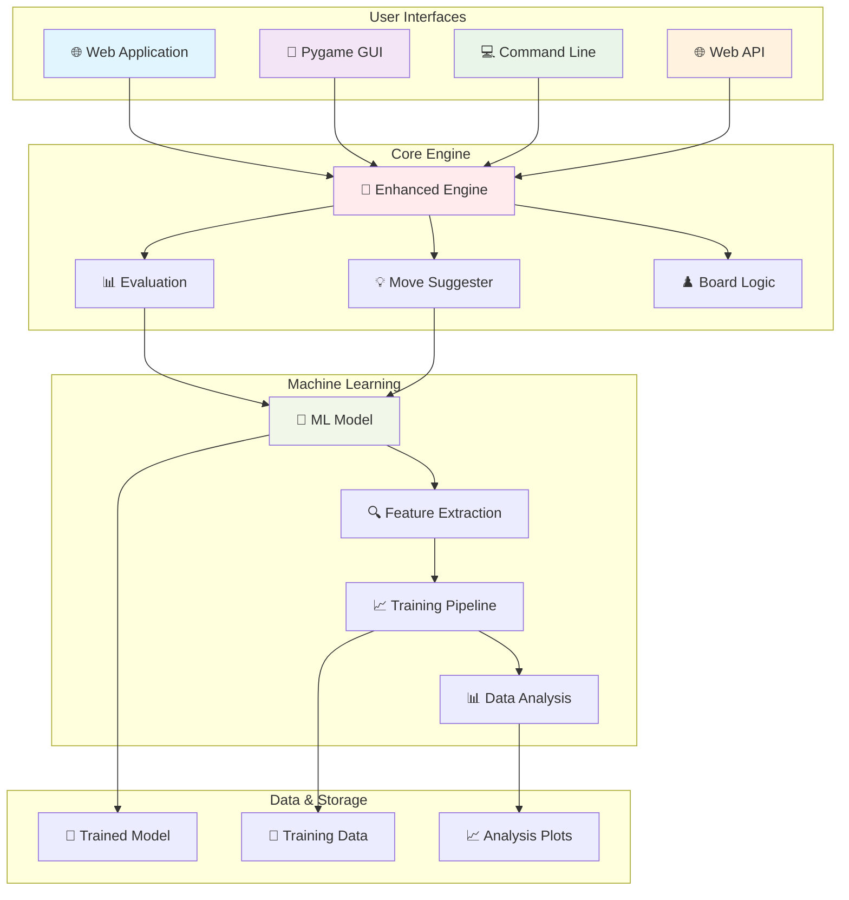
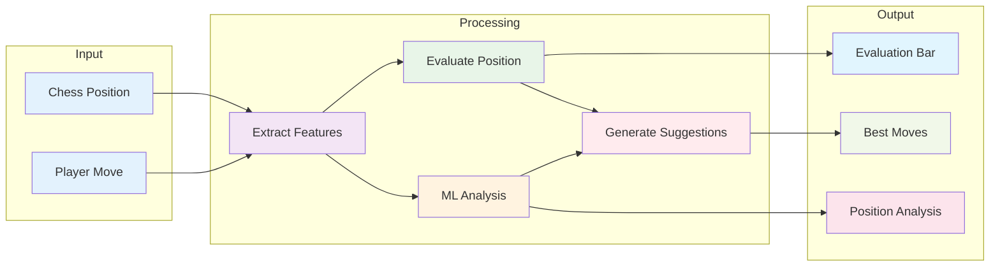
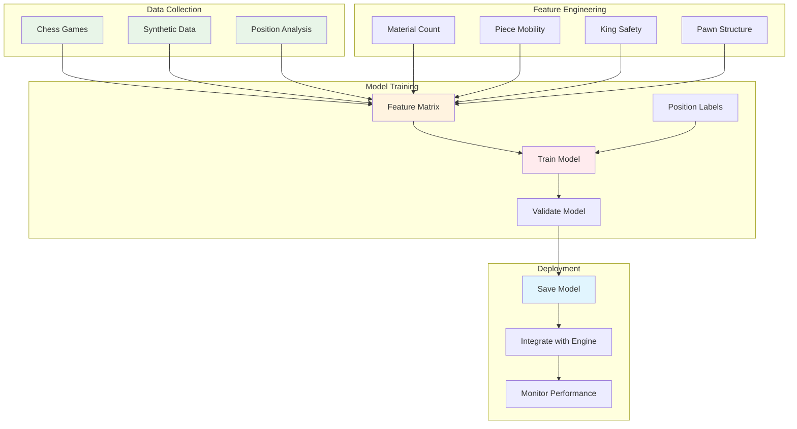
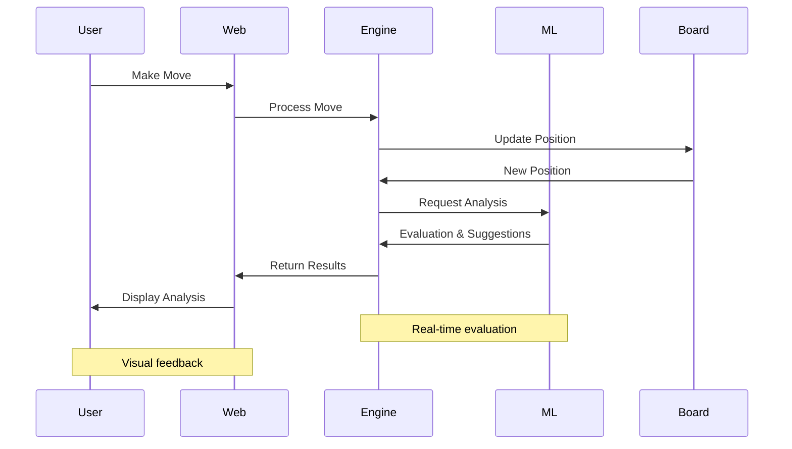
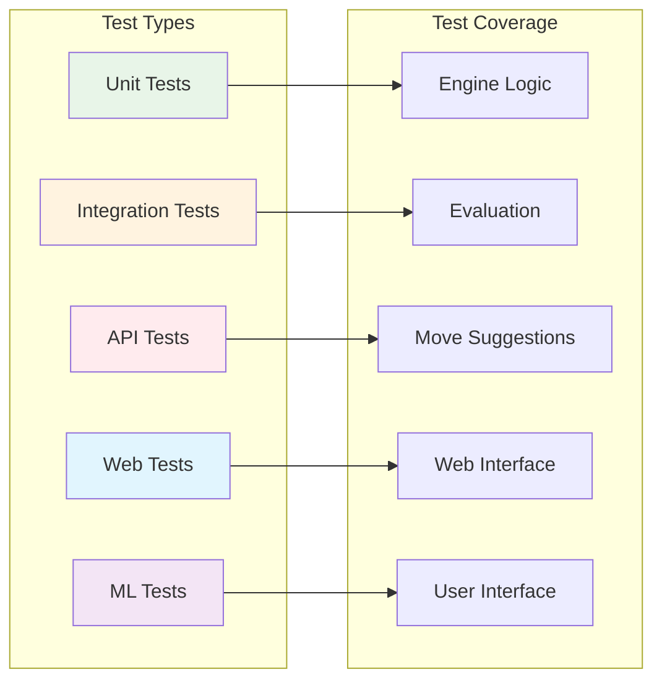
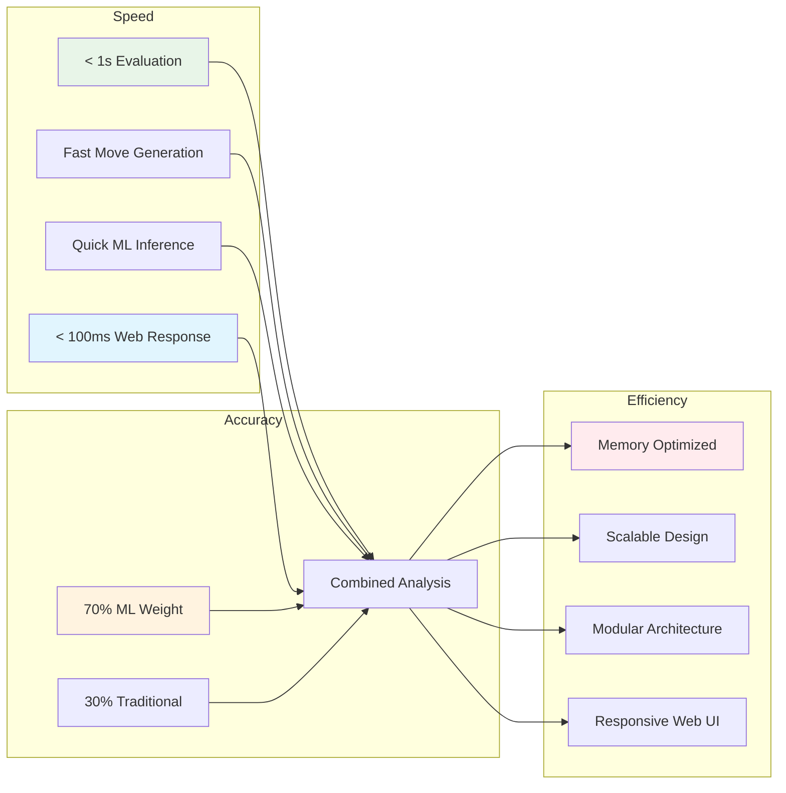
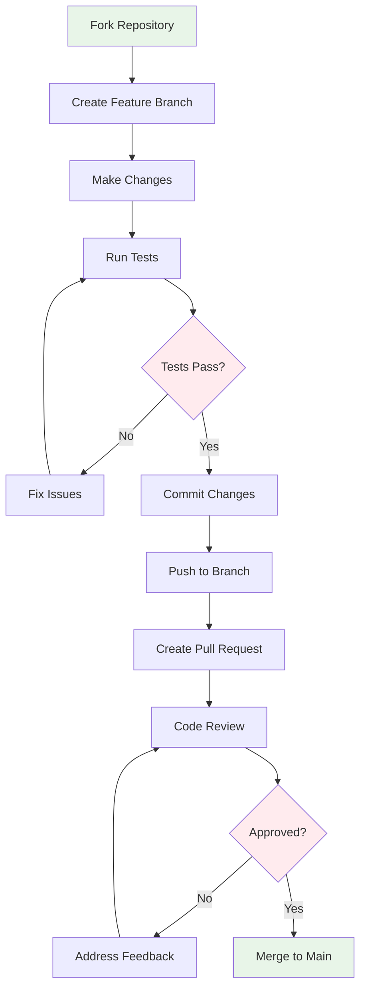

# ♟️ Foundation Chess Engine

<div align="center">


**A comprehensive Python chess engine with machine learning-powered analysis, multiple interfaces, and real-time evaluation**

[Features](#-features) • [Installation](#-installation) • [Usage](#-usage) • [Architecture](#-architecture) • [API](#-api) • [Contributing](#-contributing)

</div>

---

## 🚀 Features

### 🧠 **Machine Learning Enhanced Analysis**
- **ML-Powered Evaluation**: Combines traditional chess evaluation with trained machine learning models
- **Feature Extraction**: Advanced position analysis including material, mobility, king safety, and pawn structure
- **Predictive Move Suggestions**: AI-driven move recommendations with confidence scores
- **Real-time Learning**: Continuously improves analysis through synthetic data training

### 🎮 **Multiple User Interfaces**
- **🌐 Modern Web Application**: Beautiful, responsive web interface
- **🎨 Pygame GUI**: Beautiful graphical interface with real-time evaluation bar and move history
- **💻 Command Line Interface**: Lightweight CLI for quick analysis and scripting
- **🌐 Web API**: RESTful API for integration with web applications
- **📊 Analysis Dashboard**: Comprehensive position analysis and visualization tools

### ♟️ **Advanced Chess Features**
- **Real-time Position Evaluation**: Live analysis with numerical and visual feedback
- **Blunder Detection**: Identifies poor moves and suggests improvements
- **Move Suggestion Engine**: Top 5 best moves with detailed explanations
- **Game State Analysis**: Check, checkmate, stalemate, and draw detection
- **Opening Database**: Support for opening theory and analysis
- **Interactive Chess Board**: Drag-and-drop piece movement with legal move validation

### 🎨 **Modern Web Interface**
- **Ghana Flag-Inspired Design**: Dark theme with red, gold, and green color scheme
- **Responsive Layout**: Works seamlessly on desktop, tablet, and mobile devices
- **Real-time Updates**: Live game state, evaluation, and move suggestions
- **Interactive Elements**: Click-to-play move suggestions, board flipping, game reset
- **Beautiful Animations**: Smooth transitions and gradient animations
- **Professional UI**: Glassmorphism effects and modern design principles

### 🔧 **Developer Tools**
- **Training Pipeline**: Complete ML model training and validation system
- **Data Analysis**: Comprehensive training data analysis and visualization
- **Testing Suite**: Extensive unit tests and integration tests
- **Performance Monitoring**: Real-time engine performance metrics

---

## 📦 Installation

### Prerequisites
- **Python 3.7+**
- **Stockfish Chess Engine** (optional, for enhanced analysis)

### Quick Setup

1. **Clone the repository**
   ```bash
   git clone https://github.com/Bempong-Sylvester-Obese/Chess-Engine.git
   cd Chess-Engine
   ```

2. **Install dependencies**
   ```bash
   pip install -r requirements.txt
   ```

3. **Train the ML model** (optional)
   ```bash
   python Scripts/train_engine.py
   ```

4. **Run the web application** (recommended)
   ```bash
   cd UI/chesswebapp
   source ../../venv/bin/activate
   python run_webapp.py
   ```

---

## 🎯 Usage

### 🌐 Web Application (Recommended)
Launch the modern web interface:
```bash
cd UI/chesswebapp
source ../../venv/bin/activate
python run_webapp.py
```

**Features:**
- **Beautiful Dark Theme**: Ghana flag-inspired design with red, gold, and green accents
- **Interactive Chess Board**: Drag-and-drop piece movement with legal move validation
- **Real-time Analysis**: Live position evaluation with visual evaluation bar
- **Move Suggestions**: Click-to-play top 5 best moves with evaluations
- **Game Controls**: New game, board flip, and game reset functionality
- **Move History**: Complete game history with move notation

**Access**: Open your browser and go to `http://localhost:5001`

### 🎮 Graphical Interface (Pygame)
Launch Pygame-based chess interface:
```bash
python main.py
```

**Features:**
- Interactive chessboard with piece highlighting
- Real-time evaluation bar showing position strength
- Move history with last move highlighting
- Keyboard shortcuts (R: Reset, U: Undo)

### 💻 Command Line Interface
For quick analysis and scripting:
```bash
python UI/cli.py
```

**Features:**
- ASCII chessboard display
- UCI move input format
- Position evaluation output
- Game state tracking

### 🌐 Web API
Start the FastAPI server:
```bash
python API/server.py
```

**Available Endpoints:**
- `POST /move` - Make a move
- `GET /state` - Get current game state
- `GET /best-move` - Get engine's best move
- `POST /reset` - Reset the game

### 🔬 Advanced Analysis
Run comprehensive analysis tools:
```bash
# Train ML model
python Scripts/train_engine.py

# Analyze training data
python Scripts/analyze_training_data.py

# Generate synthetic data
python Scripts/generate_synthetic_data.py

# Visualize analysis
python Scripts/visualize_analysis.py
```

---

## 🏗️ Architecture

### System Overview



### Web Application Architecture

```mermaid
graph LR
    subgraph "Frontend"
        HTML[HTML5]
        CSS[CSS3 - Ghana Theme]
        JS[JavaScript]
        CHESSBOARD[Chessboard.js]
    end
    
    subgraph "Backend"
        FLASK[Flask Server]
        CHESS_JS[Chess.js]
        ENGINE[Python Engine]
    end
    
    subgraph "API"
        MOVE[/move]
        SUGGEST[/suggest]
        RESET[/reset]
        ANALYZE[/analyze]
    end
    
    HTML --> FLASK
    CSS --> FLASK
    JS --> FLASK
    CHESSBOARD --> FLASK
    
    FLASK --> MOVE
    FLASK --> SUGGEST
    FLASK --> RESET
    FLASK --> ANALYZE
    
    MOVE --> ENGINE
    SUGGEST --> ENGINE
    RESET --> ENGINE
    ANALYZE --> ENGINE
    
    style HTML fill:#e8f5e8
    style CSS fill:#fff3e0
    style JS fill:#ffebee
    style FLASK fill:#e1f5fe
```

### Data Flow



### Training Pipeline



### Component Interaction



```
Chess-Engine/
├── 🌐 UI/chesswebapp/         # Modern web application
│   ├── run_webapp.py         # Web app launcher
│   ├── templates/index.html  # Main web interface
│   └── static/style.css      # Ghana flag-inspired styling
├── 🎮 main.py                # Main Pygame GUI application
├── 🧠 Engine/                # Core chess engine components
│   ├── enhanced_engine.py    # ML-enhanced chess engine
│   ├── chess_suggester.py    # Move suggestion engine
│   ├── evaluation.py         # Position evaluation
│   └── board.py             # Board representation
├── 🌐 API/                   # Web API components
│   ├── server.py            # FastAPI server
│   └── endpoints.py         # API endpoints
├── 💻 UI/                    # User interfaces
│   └── cli.py               # Command line interface
├── 🔬 Scripts/               # Analysis and training tools
│   ├── train_engine.py      # ML model training
│   ├── analyze_training_data.py
│   └── visualize_analysis.py
├── 📊 Data/                  # Training data and models
│   ├── trained_model.pkl    # Trained ML model
│   └── training_data.csv    # Training dataset
└── 🧪 Tests/                 # Test suite
```

---

## 🔌 API Reference

### Core Engine API
```python
from Engine.enhanced_engine import EnhancedChessSuggester

# Initialize engine
engine = EnhancedChessSuggester()

# Get move suggestions
suggestions = engine.get_move_suggestions(board)
print(f"Evaluation: {suggestions['current_evaluation']}")
print(f"Best moves: {suggestions['suggested_moves']}")
```

### Web Application API
```bash
# Make a move
curl -X POST "http://localhost:5001/move" \
     -H "Content-Type: application/json" \
     -d '{"move": "e2e4"}'

# Get move suggestions
curl -X POST "http://localhost:5001/suggest" \
     -H "Content-Type: application/json" \
     -d '{"fen": "rnbqkbnr/pppppppp/8/8/8/8/PPPPPPPP/RNBQKBNR w KQkq - 0 1"}'

# Reset game
curl -X POST "http://localhost:5001/reset"
```

### Web API Endpoints
```bash
# Make a move
curl -X POST "http://localhost:8000/move" \
     -H "Content-Type: application/json" \
     -d '{"move": "e2e4"}'

# Get game state
curl "http://localhost:8000/state"

# Get best move
curl "http://localhost:8000/best-move?depth=15"
```

---

## 🧪 Testing

### Test Architecture



Run the comprehensive test suite:
```bash
# Run all tests
pytest Tests/

# Run specific test modules
pytest Tests/test_engine.py
pytest Tests/test_api.py
pytest Tests/test_webapp.py
pytest Tests/test_blunder.py
```

---

## 📈 Performance

### Performance Metrics



The engine features:
- **Real-time Analysis**: Sub-second position evaluation
- **ML Enhancement**: 70% ML + 30% traditional evaluation
- **Memory Efficient**: Optimized for large game trees
- **Scalable Architecture**: Modular design for easy extension
- **Fast Web Interface**: Responsive web application with < 100ms response times

---

## 🎨 Design System

### Ghana Flag-Inspired Theme

The web application features a beautiful dark theme inspired by the Ghana flag:

- **🇬🇭 Ghana Red** (`#ce1126`): Primary buttons and accents
- **🇬🇭 Ghana Gold** (`#fcd116`): Icons, highlights, and interactive elements
- **🇬🇭 Ghana Green** (`#006b3f`): Success states and background accents
- **Pure Black** (`#000000`): Main backgrounds for mysterious atmosphere
- **Animated Gradients**: Flowing background animations through Ghana colors

### Design Features
- **Glassmorphism Effects**: Modern blur and transparency effects
- **Smooth Animations**: Gradient shifts and hover transitions
- **Responsive Design**: Works perfectly on all device sizes
- **Professional UI**: Clean, modern interface with excellent UX

---

## 🤝 Contributing

### Contribution Workflow



We welcome contributions! Please see our contributing guidelines:

1. **Fork** the repository
2. **Create** a feature branch (`git checkout -b feature/amazing-feature`)
3. **Commit** your changes (`git commit -m 'Add amazing feature'`)
4. **Push** to the branch (`git push origin feature/amazing-feature`)
5. **Open** a Pull Request

### Development Setup
```bash
# Install development dependencies
pip install -r requirements.txt

# Run linting
black .
pylint Engine/ Tests/ Scripts/

# Run tests
pytest Tests/

# Start web development server
cd UI/chesswebapp
python run_webapp.py
```

---

## 📄 License

This project is licensed under the MIT License - see the [LICENSE](LICENSE) file for details.


<div align="center">

**Made with ♟️ and ❤️ by the Foundation Chess Engine Team**

</div>

