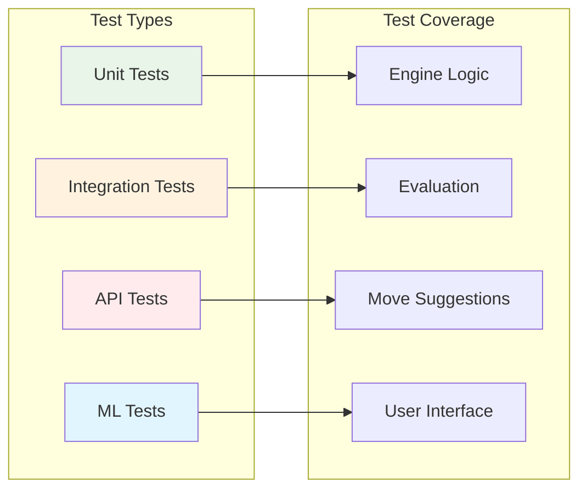
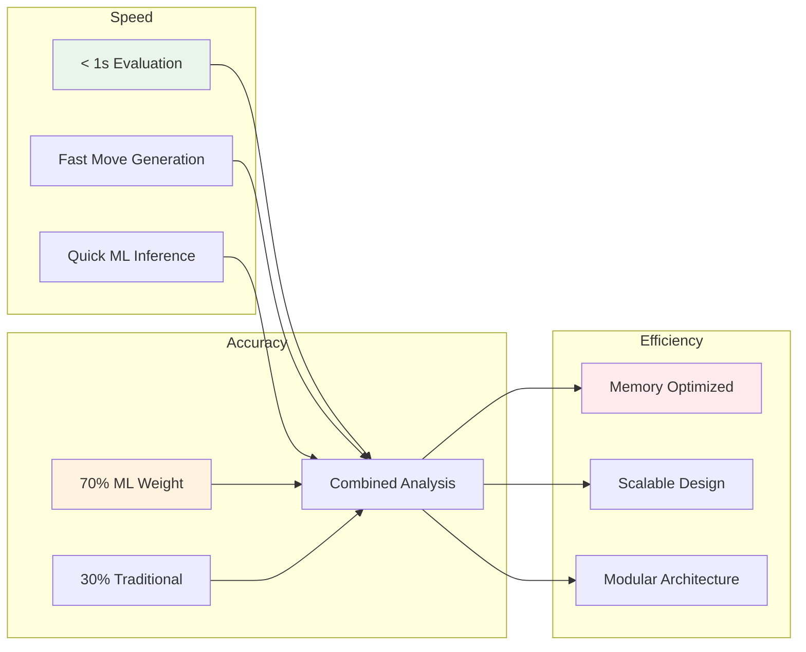

# ♟️ BCF Chess Engine

<div align="center">


**A comprehensive Python chess engine with machine learning-powered analysis, multiple interfaces, and real-time evaluation**

[Features](#-features) • [Installation](#-installation) • [Usage](#-usage) • [Architecture](#-architecture) • [API](#-api) • [Contributing](#-contributing)

</div>

---

## 🚀 Features

### 🧠 **Machine Learning Enhanced Analysis**
- **ML-Powered Evaluation**: Combines traditional chess evaluation with trained machine learning models
- **Feature Extraction**: Advanced position analysis including material, mobility, king safety, and pawn structure
- **Predictive Move Suggestions**: AI-driven move recommendations with confidence scores
- **Real-time Learning**: Continuously improves analysis through synthetic data training

### 🎮 **Multiple User Interfaces**
- **🎨 Pygame GUI**: Beautiful graphical interface with real-time evaluation bar and move history
- **💻 Command Line Interface**: Lightweight CLI for quick analysis and scripting
- **🌐 Web API**: RESTful API for integration with web applications
- **📊 Analysis Dashboard**: Comprehensive position analysis and visualization tools

### ♟️ **Advanced Chess Features**
- **Real-time Position Evaluation**: Live analysis with numerical and visual feedback
- **Blunder Detection**: Identifies poor moves and suggests improvements
- **Move Suggestion Engine**: Top 5 best moves with detailed explanations
- **Game State Analysis**: Check, checkmate, stalemate, and draw detection
- **Opening Database**: Support for opening theory and analysis

### 🔧 **Developer Tools**
- **Training Pipeline**: Complete ML model training and validation system
- **Data Analysis**: Comprehensive training data analysis and visualization
- **Testing Suite**: Extensive unit tests and integration tests
- **Performance Monitoring**: Real-time engine performance metrics

---

## 📦 Installation

### Prerequisites
- **Python 3.7+**
- **Stockfish Chess Engine** (optional, for enhanced analysis)

### Quick Setup

1. **Clone the repository**
   ```bash
   git clone <repository-url>
   cd Chess-Engine
   ```

2. **Install dependencies**
   ```bash
   pip install -r requirements.txt
   ```

3. **Train the ML model** (optional)
   ```bash
   python Scripts/train_engine.py
   ```

4. **Run the main application**
   ```bash
   python main.py
   ```

---

## 🎯 Usage

### 🎮 Graphical Interface (Recommended)
Launch the beautiful Pygame-based chess interface:
```bash
python main.py
```

**Features:**
- Interactive chessboard with piece highlighting
- Real-time evaluation bar showing position strength
- Move history with last move highlighting
- Keyboard shortcuts (R: Reset, U: Undo)

### 💻 Command Line Interface
For quick analysis and scripting:
```bash
python UI/cli.py
```

**Features:**
- ASCII chessboard display
- UCI move input format
- Position evaluation output
- Game state tracking

### 🌐 Web API
Start the FastAPI server:
```bash
python API/server.py
```

**Available Endpoints:**
- `POST /move` - Make a move
- `GET /state` - Get current game state
- `GET /best-move` - Get engine's best move
- `POST /reset` - Reset the game

### 🔬 Advanced Analysis
Run comprehensive analysis tools:
```bash
# Train ML model
python Scripts/train_engine.py

# Analyze training data
python Scripts/analyze_training_data.py

# Generate synthetic data
python Scripts/generate_synthetic_data.py

# Visualize analysis
python Scripts/visualize_analysis.py
```

---

## 🏗️ Architecture

### System Overview

```mermaid
graph TB
    subgraph "User Interfaces"
        GUI[🎨 Pygame GUI]
        CLI[💻 Command Line]
        API[🌐 Web API]
        WEB[📊 Web Dashboard]
    end
    
    subgraph "Core Engine"
        ENGINE[🧠 Enhanced Engine]
        EVAL[📊 Evaluation]
        SUGGEST[💡 Move Suggester]
        BOARD[♟️ Board Logic]
    end
    
    subgraph "Machine Learning"
        ML[🤖 ML Model]
        FEATURES[🔍 Feature Extraction]
        TRAINING[📈 Training Pipeline]
        DATA[📊 Data Analysis]
    end
    
    subgraph "Data & Storage"
        MODEL[💾 Trained Model]
        DATASET[📁 Training Data]
        PLOTS[📈 Analysis Plots]
    end
    
    GUI --> ENGINE
    CLI --> ENGINE
    API --> ENGINE
    WEB --> ENGINE
    
    ENGINE --> EVAL
    ENGINE --> SUGGEST
    ENGINE --> BOARD
    
    EVAL --> ML
    SUGGEST --> ML
    ML --> FEATURES
    FEATURES --> TRAINING
    TRAINING --> DATA
    
    ML --> MODEL
    TRAINING --> DATASET
    DATA --> PLOTS
    
    style GUI fill:#e1f5fe
    style CLI fill:#f3e5f5
    style API fill:#e8f5e8
    style WEB fill:#fff3e0
    style ENGINE fill:#ffebee
    style ML fill:#f1f8e9
```



### Data Flow


### Training Pipeline


### Component Interaction


```
Chess-Engine/
├── 🎮 main.py                 # Main Pygame GUI application
├── 🧠 Engine/                 # Core chess engine components
│   ├── enhanced_engine.py     # ML-enhanced chess engine
│   ├── chess_suggester.py     # Move suggestion engine
│   ├── evaluation.py          # Position evaluation
│   └── board.py              # Board representation
├── 🌐 API/                    # Web API components
│   ├── server.py             # FastAPI server
│   └── endpoints.py          # API endpoints
├── 💻 UI/                     # User interfaces
│   ├── cli.py                # Command line interface
│   └── chesswebapp/          # Web interface assets
├── 🔬 Scripts/                # Analysis and training tools
│   ├── train_engine.py       # ML model training
│   ├── analyze_training_data.py
│   └── visualize_analysis.py
├── 📊 Data/                   # Training data and models
│   ├── trained_model.pkl     # Trained ML model
│   └── training_data.csv     # Training dataset
└── 🧪 Tests/                  # Test suite
```

---

## 🔌 API Reference

### Core Engine API
```python
from Engine.enhanced_engine import EnhancedChessSuggester

# Initialize engine
engine = EnhancedChessSuggester()

# Get move suggestions
suggestions = engine.get_move_suggestions(board)
print(f"Evaluation: {suggestions['current_evaluation']}")
print(f"Best moves: {suggestions['suggested_moves']}")
```

### Web API Endpoints
```bash
# Make a move
curl -X POST "http://localhost:8000/move" \
     -H "Content-Type: application/json" \
     -d '{"move": "e2e4"}'

# Get game state
curl "http://localhost:8000/state"

# Get best move
curl "http://localhost:8000/best-move?depth=15"
```

---

## 🧪 Testing

### Test Architecture



Run the comprehensive test suite:
```bash
# Run all tests
pytest Tests/

# Run specific test modules
pytest Tests/test_engine.py
pytest Tests/test_api.py
pytest Tests/test_blunder.py
```

---

## 📈 Performance

### Performance Metrics



The engine features:
- **Real-time Analysis**: Sub-second position evaluation
- **ML Enhancement**: 70% ML + 30% traditional evaluation
- **Memory Efficient**: Optimized for large game trees
- **Scalable Architecture**: Modular design for easy extension

---

## 🤝 Contributing

### Contribution Workflow


We welcome contributions! Please see our contributing guidelines:

1. **Fork** the repository
2. **Create** a feature branch (`git checkout -b feature/amazing-feature`)
3. **Commit** your changes (`git commit -m 'Add amazing feature'`)
4. **Push** to the branch (`git push origin feature/amazing-feature`)
5. **Open** a Pull Request

### Development Setup
```bash
# Install development dependencies
pip install -r requirements.txt

# Run linting
black .
pylint Engine/ Tests/ Scripts/

# Run tests
pytest Tests/
```

---

## 📄 License

This project is licensed under the MIT License - see the [LICENSE](LICENSE) file for details.

---

## 🙏 Acknowledgments

- **python-chess**: Core chess logic and board representation
- **Stockfish**: Advanced chess engine integration
- **scikit-learn**: Machine learning capabilities
- **Pygame**: Graphical user interface
- **FastAPI**: Web API framework

---

<div align="center">

**Made with ♟️ and ❤️ by the BCF Chess Engine Team**

[Report Bug](https://github.com/your-repo/issues) • [Request Feature](https://github.com/your-repo/issues) • [Documentation](Docs/)

</div>

